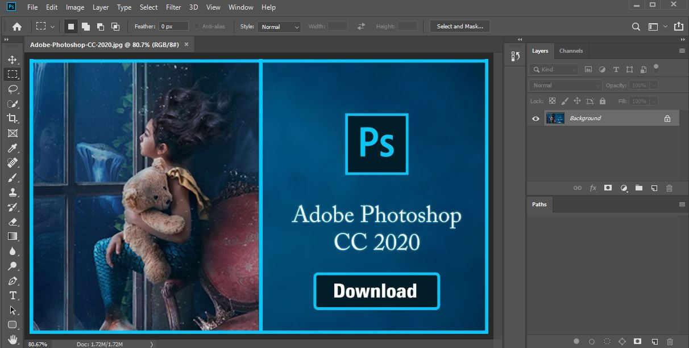

# Photoshop CC v21.0.2 installer for Linux
This program written in C will help you to automatically install everything you need and configure it so that you can run Photoshop on your Linux without problems.

 

## :rocket: Features
- Automatically check your system requirements (read below) so you know if you can install Photoshop
- Automatically install everything you need to run Photoshop
- Creates a Photoshop shortcut in your Gnome Apps for execute it
- Install and configure Adobe Camera Raw v12, if you want
- If you don't use Photoshop anymore, you can uninstall all files in a custom way
- Support wine dark mode
- It's free and you will not need any license key

## :computer: Installation
If you are new in Linux and don't know some commands, you can watch this video (made thanks to Don of Novaspirit Tech channel) for more easy installation:

First of all check if your distro is compatible:

Compatible Distros:

- Fedora (Compatible with all versions that share the same WineHQ repository, currently from 29 to 34)
- Debian 10 (Buster) and any other Debian based distro
- Arch Linux and any other Arch based distro

If it is compatible open your terminal, run the following commands and follow the installer:

>
>git clone https://gitlab.com/csmarckitus1/photoshop.git

And then:

>
>cd photoshop; make; ./Photoshop2020
>
>NOTE: If you get an memory access error message, you need to install valgrind in your distro and execute the program with it.
> 
> Example in an Arch or based distro:
> 
> Install the program: sudo pacman -S valgrind
> 
>Executing the program: cd photoshop; make; valgrind ./Photoshop2020

 

Changing Language pack to English (US)

  Note: The default language for this setup files is Spanish.
   
  To change it in English(US), follow the given steps:
   
  - Place the en_US directory to the following path: PhotoshopCC/Photoshop-CC/Locales/
   
  - Then, Run photoshop, go to edit in the navigation bar, then preferences>interface
   
  - Then change the UI language from espanyol to English
   
  - Restart Photoshop

Important things during the installation

**During the installer you will see for a moment that Windows 7 is selected by default, change it to Windows 10.**
   
**If you have a 4k monitor or open Photoshop and it looks small, in the same place go to the Graphics tab and increase the resolution between 216 and 240 ppp.**
   
Once all this is done apply the changes.
 
>Photoshop may sometimes start with a black screen, just Create a new file or just drag in some photo.
 
Before starting any project try to Save the file first. In case it doesn't let you do the following:

>File -> Export -> Export Layers to Files
>Finally the files will be saved, now restart Photoshop and open the file you have created. Now everything you do in that file will be saved for you.
>
> 
>
>**A few things about check requirements:**
>- The requirements are based on the technical specifications provided by the Adobe page according to the Windows operating system, **so it is possible that although > some requirements are not met in Linux, Photoshop can be executed.**
>- Is possible that when checks requirements, in computers that don't have dedicated VRAM (As they use a chunk of memory RAM) in some cases the result, is that you can run Photoshop, but this is not really.
>

---

Possible errors, bugs or for the people that want add or try new features:

 

- Errors or bugs:
    - If make not works, copy and paste this in terminal in the current folder:
    > gcc -ggdb3 -O0 -std=c99 -Wall -Werror -Wextra -Wno-sign-compare -Wno-unused-parameter -Wno-unused-variable -Wshadow -pedantic -w -o Photoshop2020 Photoshop.c ./scripts/Requirements.c ./scripts/Installer.c ./scripts/Cameraraw.c ./scripts/Configure.c ./scripts/Uninstaller.c ./Photoshop2020
    >

     

    - If the program has an error in somewhere of installer, first uninstall Photoshop.

    - I have installed Wine but my system does not recognize it, why? If you use any shell different than the default provided by system, you need to add the PATH of the path of installation of WINE.
    
    - If your distro is not compatible you have to modify the program so that the installation can continue and you have to install WineHQ yourself.

 

- New features:
    - If you want to try the staging version of Wine, Adobe Camera Raw has not worked for me.

Notes:

- I use getchar in some lines for clear stdin and doing that a command can be read by scanf.

- The main file is Photoshop.c

